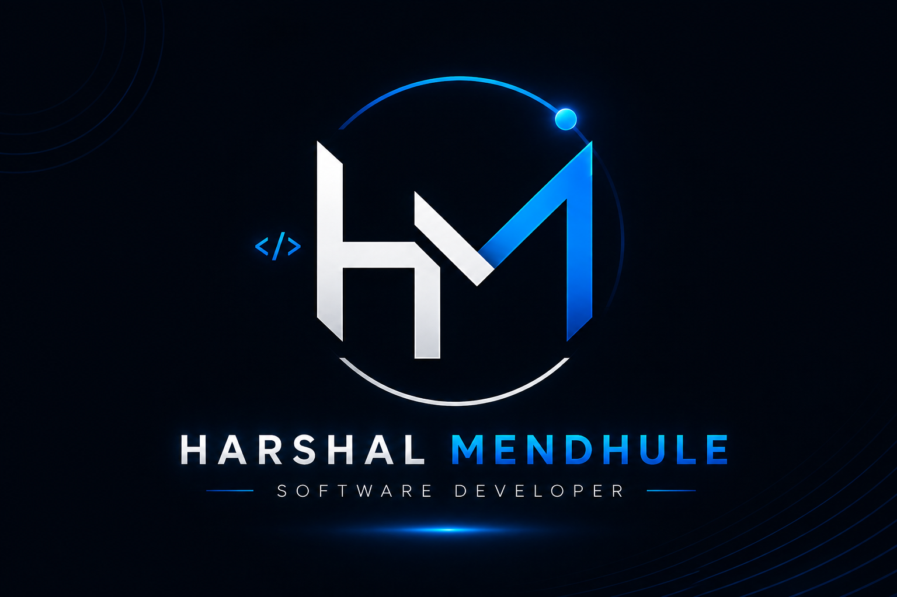

# Harshal Mendhule — Developer Portfolio

A modern, responsive, and interactive developer portfolio built to showcase my projects, technical skills, experience, achievements, certifications.

## 🌐 Live Portfolio

> Add your deployed Vercel URL here

**Portfolio:** `https://your-portfolio.vercel.app`

---

## ✨ Features

- 📱 Fully responsive design for desktop, tablet, and mobile
- ⚡ Fast and optimized React + Vite application
- 🎬 Animated loading screen with HM branding
- ✨ Smooth scroll and section-reveal animations
- 🧭 Interactive navigation with active-section detection
- 📂 Dynamic project showcase
- 🖼️ Project screenshots and image galleries
- 🔍 Detailed project information through interactive modals
- 🏆 Achievements and competition showcase
- 📜 Certifications section
- 💼 Experience and internship timeline
- 🎓 Education section
- 🛠️ Categorized technical skills
- 📄 Downloadable resume
- 📬 Contact section
- 🔗 GitHub, LinkedIn and other social links
- 📱 Mobile-friendly navigation menu

---

## 🛠️ Tech Stack

| Technology | Purpose |
|---|---|
| **React 19** | Frontend UI |
| **Vite** | Development and build tooling |
| **Tailwind CSS v4** | Styling and responsive design |
| **Framer Motion** | Animations and transitions |
| **Lucide React** | Icons |
| **Vercel** | Deployment |

---

